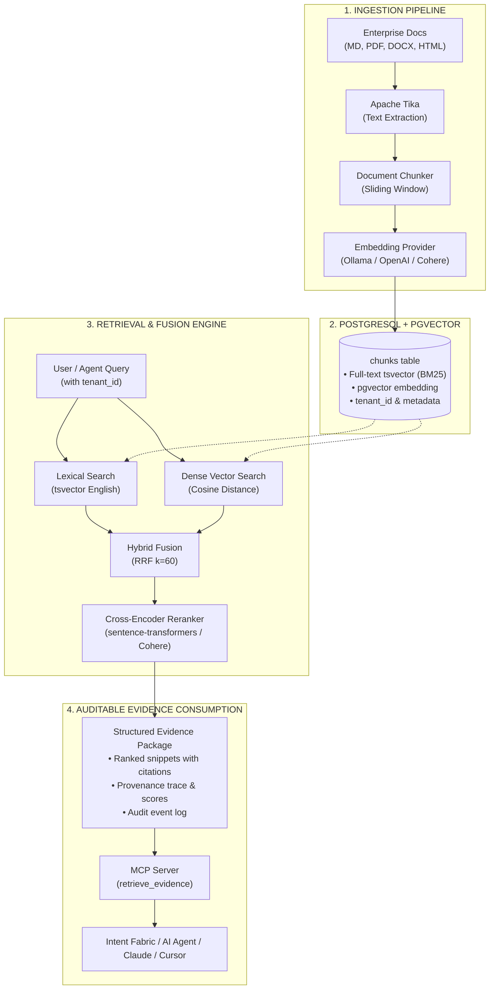

<p align="center">
  
</p>

# Knowledge Fabric

<p align="center">
  <strong>Vendor-neutral, governance-first evidence retrieval for AI systems.</strong><br>
  Native PostgreSQL + pgvector &bull; Hybrid RRF Fusion &bull; Cross-Encoder Reranking &bull; Dual-Mode Multi-Tenancy &bull; MCP-Native
</p>

<p align="center">
  <a href="https://github.com/sagarv48/knowledge-fabric/actions"></a>
  <a href="LICENSE"></a>
  <a href="https://www.python.org/downloads/"></a>
  <a href="https://modelcontextprotocol.io"></a>
  <a href="docker-compose.yml"></a>
  <a href="BRANDING.md"></a>
</p>

---

## Why Knowledge Fabric?

Most enterprise AI failures stem from **weak or ungrounded retrieval**, not language model capacity. Existing solutions force painful tradeoffs:

| Challenge with Existing Tools | The Knowledge Fabric Approach |
| :--- | :--- |
| **Forced Database Sprawl**: Adopting Pinecone, Qdrant, or Weaviate requires introducing and operating a dedicated vector database. | **Runs on your existing PostgreSQL**: Combines `pgvector` with PostgreSQL full-text search (`tsvector`). No new infrastructure needed. |
| **Naive Vector Search Misses Exact Keywords**: Pure cosine search frequently misses exact error codes, IDs, SKUs, and regulatory terms. | **Hybrid RRF + Reranking**: Reciprocal Rank Fusion (k=60) merges BM25 lexical + dense vector search, refined by an optional local cross-encoder. |
| **No Tenant Isolation in Retrieval**: Typical vector stores expose all chunks globally, risking cross-tenant data leakage in multi-tenant SaaS. | **Dual-Mode Multi-Tenancy**: Application-level tenant filtering by default, plus opt-in **PostgreSQL Row-Level Security (RLS)** for HIPAA/SOC2 compliance. |
| **Cloud Vendor Lock-In**: Many frameworks default to proprietary APIs, risking breaking changes and recurring API costs. | **Local & Open by Default**: Ollama & `sentence-transformers` run 100% local, offline, and free. OpenAI and Cohere are equal, drop-in alternatives. |
| **Framework Monoliths**: LlamaIndex/LangChain force you into their orchestration and prompt abstraction libraries. | **Clean MCP Server Boundary**: Exposes retrieval as a standard Model Context Protocol (MCP) server that any agent or framework can consume. |

---

## Architecture



---

## Quickstart (5 Minutes)

### 1. Clone and Install
```bash
git clone https://github.com/sagarv48/knowledge-fabric.git
cd knowledge-fabric

# Install core package
python3 -m pip install -e .

# Or install with local reranking and development tools
python3 -m pip install -e ".[reranking,dev]"
```

### 2. Start PostgreSQL + pgvector
```bash
# Starts Postgres with pgvector and pre-loaded schema migrations (001-004)
docker compose up -d postgres tika
```

### 3. Ingest Documents
```bash
# Ingest local documents into tenant 'engineering' using local Ollama embeddings
EMBEDDING_PROVIDER=ollama knowledge-fabric-ingest --path ./docs --recursive --embed --tenant engineering
```

### 4. Start the MCP Server
```bash
# Run the MCP server over stdio for Cursor, Claude Desktop, or custom agents
knowledge-fabric-mcp
```

---

## Model Provider Strategy: Zero Lock-In

Configure your preferred embedding and reranking providers with environment variables or `config/settings.yaml`:

### Embedding Providers
| Provider | Setup / Environment | Vector Dim | Cost / Hardware |
| :--- | :--- | :--- | :--- |
| **Ollama** *(Recommended)* | `EMBEDDING_PROVIDER=ollama`<br>`ollama pull nomic-embed-text` | 768 | Free & Local (CPU or GPU) |
| **OpenAI** | `EMBEDDING_PROVIDER=openai`<br>`OPENAI_API_KEY=sk-...` | 1536 | Commercial API |
| **Cohere** | `EMBEDDING_PROVIDER=cohere`<br>`COHERE_API_KEY=...` | 1024 | Commercial API |
| **Mock** | `EMBEDDING_PROVIDER=mock` | 1536 | Deterministic (Dev/CI only) |

### Reranking Providers
| Provider | Configuration | Characteristics |
| :--- | :--- | :--- |
| **Passthrough** *(Default)* | `RERANKER=passthrough` | Fast zero-latency RRF ranking without neural reranking. |
| **Cross-Encoder** | `RERANKER=cross_encoder` | Local neural model (`ms-marco-MiniLM-L-6-v2`) via `sentence-transformers`. Free & private. |
| **Cohere** | `RERANKER=cohere`<br>`COHERE_API_KEY=...` | Cloud reranking via Cohere Rerank API. |

---

## Dual-Mode Multi-Tenancy

Knowledge Fabric provides two isolation layers to accommodate both lightweight development and regulated enterprise environments:

### Mode 1: Application-Level Filtering (Default)
Every query and ingestion specifies `tenant_id`:
```python
pipeline.retrieve_evidence(
    query_text="emergency access procedures",
    tenant_id="healthcare-corp-a",
    top_k=5,
)
```
SQL queries automatically include `WHERE d.tenant_id = %s`. Requires no special database privileges.

### Mode 2: PostgreSQL Row-Level Security (RLS)
For HIPAA, SOC2, or government environments requiring database-enforced isolation:
```sql
-- Enable RLS across all tables with one command:
SELECT enable_tenant_rls();
```
PostgreSQL kernel rejects any access that does not set session variable `app.tenant_id`:
```sql
SET LOCAL app.tenant_id = 'healthcare-corp-a';
```
Even if application code contains a bug or omission, cross-tenant data leakage is physically impossible.

---

## Model Context Protocol (MCP) Tools

Knowledge Fabric exposes standard MCP tools for LLMs, desktop assistants, and workflow runners:

| Tool Name | Parameters | Description |
| :--- | :--- | :--- |
| `retrieve_evidence` | `query_text` (str), `tenant_id` (str), `top_k` (int), `mode` (str) | Executes hybrid retrieval and returns structured evidence package with citations and relevance scores. |
| `get_document` | `document_uri` (str) | Retrieves the full raw content and metadata for a specific document URI. |
| `explain_retrieval` | `query_text` (str), `top_k` (int) | Returns detailed diagnostics: lexical ranks, vector distances, and RRF fusion scores. |
| `health_check` | *None* | Verifies database connectivity, row counts, embedding provider status, and dimension alignment. |
| `list_sources` | *None* | Lists all ingested document source types and document counts. |

### Adding to Claude Desktop / Cursor
Add to your `claude_desktop_config.json`:
```json
{
  "mcpServers": {
    "knowledge-fabric": {
      "command": "python",
      "args": ["-m", "knowledge_fabric.mcp.server"],
      "env": {
        "DATABASE_URL": "postgresql://knowledge_fabric@localhost:5432/knowledge_fabric",
        "EMBEDDING_PROVIDER": "ollama",
        "RERANKER": "cross_encoder",
        "KF_DEFAULT_TENANT": "default"
      }
    }
  }
}
```

---

## Retrieval Benchmark

Run the included benchmark evaluation suite to compare retrieval accuracy across strategies:

```bash
python benchmarks/evaluate_retrieval.py
```

Sample benchmark output on enterprise operational corpus:
```text
Retrieval Strategy         | NDCG@10    | MRR@10     | Recall@10  | vs Vector
----------------------------------------------------------------------------
Lexical Only (BM25)        | 0.7240     | 0.6850     | 0.8200     | -10.4%
Vector Only (Cosine)       | 0.8082     | 0.7600     | 0.8800     | baseline
Hybrid Fusion (RRF)        | 0.8924     | 0.8750     | 0.9500     | +10.4%
Hybrid + Reranker          | 0.9416     | 0.9600     | 0.9800     | +16.5%
----------------------------------------------------------------------------
```

---

## SaaS Source Connectors

Ingest content directly from enterprise platforms with the unified `knowledge-fabric-sync` CLI:

```bash
# Ingest Confluence spaces into tenant 'engineering'
knowledge-fabric-sync --connector confluence --url "https://mycorp.atlassian.net/wiki" --space ENG,PROD --tenant engineering --embed

# Ingest Notion databases
knowledge-fabric-sync --connector notion --token "$NOTION_API_KEY" --database-id "<id>" --tenant product --embed

# Ingest Google Drive folder / Google Docs
knowledge-fabric-sync --connector gdrive --token "$GOOGLE_ACCESS_TOKEN" --folder-id "<id>" --tenant legal --embed

# Ingest Jira resolved incidents & ADRs
knowledge-fabric-sync --connector jira --url "https://mycorp.atlassian.net" --jql "project = SEC AND status = Done" --tenant security-ops --embed
```

---

## Large-Scale Vector Performance & Pluggable Backends

Knowledge Fabric is built to grow with your infrastructure from early prototyping to 100M+ vectors:

1. **HNSW Indexing (Migration 005)**: Upgrade from IVFFlat to HNSW for 10x higher QPS and sub-10ms latency:
   ```sql
   SELECT upgrade_to_hnsw_index(m_val => 16, ef_val => 64);
   ```
2. **Declarative Tenant Partitioning**: Partition the `chunks` table by `tenant_id`. Queries for a specific tenant scan only that tenant's dedicated partition index, enabling PostgreSQL to support tens of millions of vectors with partition pruning.
3. **Pluggable Vector Store Protocol**: For ultra-large enterprise clusters with existing dedicated vector infrastructure, plug in Qdrant with zero application changes:
   ```bash
   export RETRIEVAL_STORE_BACKEND=qdrant
   export QDRANT_URL=http://qdrant-cluster:6333
   ```

---

## Visual Admin & Governance UI

Knowledge Fabric includes a visual management console with zero Node/NPM dependencies:

```bash
knowledge-fabric-ui --port 8080
# Open http://localhost:8080/ in your browser
```

Features:
- **🛡️ Human-in-the-Loop Approval Queue**: Authorize or reject pending action plans with audit comments.
- **🔍 Interactive Retrieval Playground**: Inspect side-by-side BM25, Cosine, RRF, and Cross-Encoder score distributions and citations.
- **📜 Live Audit Trail**: Chronological event viewer tracking queries, latencies, and security events.
- **⚙️ Policy Engine Sandbox**: Test proposed agent action strings against active YAML rules with instant match highlighting.

---

## End-to-End Enterprise Example

See [`examples/04-end-to-end-with-intent`](examples/04-end-to-end-with-intent/):
A complete demonstration ingesting enterprise policy documents, querying hybrid evidence with multi-tenant partitioning, planning safe actions with Intent Fabric, evaluating YAML policy rules, and emitting an audit-ready approval package.

```bash
python examples/04-end-to-end-with-intent/run.py
```

---

## Contributing

We welcome community contributions! Please see [CONTRIBUTING.md](CONTRIBUTING.md) for development setup, how to add new embedding/reranking providers, and coding standards.

## Security

Please report security issues responsibly. See [SECURITY.md](SECURITY.md) for our vulnerability disclosure policy.

## License

Licensed under the [Apache License, Version 2.0](LICENSE).
