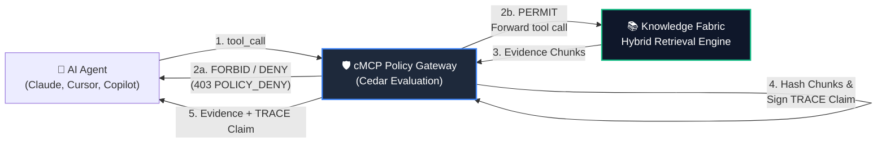

# Zero-Trust Governed Retrieval: cMCP × Knowledge Fabric

> **Give your AI agents access to corporate knowledge — without giving them access to everything.**

[](https://github.com/sagarv48/knowledge-fabric)
[](https://github.com/agentrust-io/cmcp)
[](https://www.cedarpolicy.com/)
[](https://agentrust-io.com/)

---

## The Problem Every Enterprise Faces

Deploying generative AI agents inside enterprises is stalled not by model intelligence, but by **governance and security**:

1. **Unconstrained Tool Access**: Standard Model Context Protocol (MCP) servers grant connected LLMs sweeping access to all tools and all documents within a server.
2. **Prompt Injection & Tenant Smuggling**: Malicious or hijacked prompts can instruct agents to bypass application logic and retrieve confidential executive compensation, unannounced financial filings, or competitor tenant data.
3. **The Audit Gap**: When an AI agent takes an action or generates a recommendation, compliance and security teams cannot mathematically prove *which exact document chunks* the agent relied upon at that moment.

Traditional solutions force organizations into an unworkable binary choice: lock AI agents out of enterprise databases entirely, or expose sensitive corporate knowledge to unpredictable agent behavior.

---

## The Solution: Policy-Governed Evidence Retrieval

This reference architecture couples **Knowledge Fabric** (high-precision hybrid retrieval with lexical search, vector similarity, and Reciprocal Rank Fusion) with **cMCP** (Confidential Model Context Protocol) acting as an autonomous **Front-Door Policy Gateway**.



### Key Architectural Guarantees

* **Zero Unchecked Invocations**: Tool calls (`retrieve_evidence`, `get_document`) are intercepted *before* reaching the Knowledge Fabric database.
* **Precedence-Ordered Cedar Policies**: Fine-grained, human-readable Cedar rules enforce mathematical default-deny and forbid precedence.
* **Cryptographic Evidence Binding**: Every permitted retrieval produces a signed **TRACE Claim** containing SHA-256 hashes of the exact evidence chunks returned. If any citation or chunk is tampered with, verification fails.
* **Zero Database Load on Violations**: Denied queries are blocked at the perimeter without executing embedding models or PostgreSQL vector searches.

---

## Who This Is For

| Stakeholder | Primary Concern | What This Architecture Delivers |
|-------------|----------------|---------------------------------|
| **CISO / Head of Security** | Preventing data exfiltration & prompt injection | Default-deny Cedar gateway perimeter; forbidden tenants can never be queried by unauthorized agents. |
| **VP of Engineering** | Clean, decoupled architectural boundaries | Enterprise governance lives in declarative `.cedar` policy files, not scattered across Python application code. |
| **Compliance & SOC 2 Auditors** | Verifiable data lineage and auditability | Cryptographic TRACE claims provide tamper-evident proof of exactly which documents an AI viewed. |
| **AI / ML Engineers** | Seamless developer experience & low latency | Standard MCP tool interface preserved; zero code changes needed on calling agent workflows. |
| **Multi-Tenant SaaS Architects** | Customer tenant data leakage | Strict caller-to-resource tenant boundary matching enforced at the network front door. |

---

## Real-World Scenarios Included

This reference integration provides a runnable test bed modeling **5 concrete organizational situations**:

| # | Scenario | Persona | Agent Action | Expected Outcome | Active Policy Rule |
|---|----------|---------|--------------|------------------|-------------------|
| **1** | **Employee Self-Service** | Maya, Product Designer | Searches employee handbook for vacation and PTO policies | ✅ **200 PERMIT** — Returns 3 evidence chunks with signed TRACE claim | `employee_self_service` |
| **2** | **Compensation Firewall** | Maya, Product Designer | Attempts to search executive salary bands in `hr-compensation` | 🚫 **403 POLICY_DENY** — Blocked at gateway; zero DB queries | `compensation_firewall` |
| **3** | **SecOps Break-Glass** | Raj, Incident Commander | Queries incident response runbooks during an active P1 outage | ✅ **200 PERMIT** — Incident-conditional access granted with claim | `secops_break_glass` |
| **4** | **Multi-Tenant Customer Isolation** | Acme Corp SaaS Agent | Attempts to query competitor documents belonging to Globex Corp | 🚫 **403 POLICY_DENY** — Cross-tenant prompt injection blocked | `cross_tenant_isolation` |
| **5** | **Cryptographic Audit Proof** | Internal Compliance Auditor | Verifies TRACE claim hashes against retrieved chunks & bundle signature | ✅ **VERIFIED** — Mathematical proof of tamper-free evidence | `TraceClaim.verify()` |

---

## Quickstart

### Option 1: Run Locally (30 Seconds, Zero External Dependencies)

The local reference runner is completely self-contained in the Python standard library. It requires no Docker, no external database, and no Rust compilation:

```bash
# Navigate to the example directory
cd examples/governed-retrieval-cmcp

# Run the 5 interactive scenarios
python run.py
```

You will see the complete step-by-step terminal execution, including policy compilation, rule evaluation, chunk evidence formatting, and cryptographic signature verification.

---

### Option 2: Full Stack Deployment via Docker Compose

To run the complete production-style architecture with PostgreSQL pgvector, the Knowledge Fabric core service, and the cMCP gateway proxy:

```bash
cd examples/governed-retrieval-cmcp

# Launch the 3-tier container stack
docker compose up -d

# Verify services
docker compose ps
```

The stack exposes:
* **Port `5433`**: PostgreSQL with pgvector (offset to avoid conflicts with existing standard PostgreSQL instances).
* **Port `8081`**: Knowledge Fabric Core (direct backend access).
* **Port `8082`**: cMCP Zero-Trust Gateway (governed proxy endpoint).

Run the verification test against the stack:
```bash
python run.py --docker
```

To tear down the containers:
```bash
docker compose down -v
```

---

## Understanding the Cedar Policies

Policies are defined in [`policies/retrieval-policy.cedar`](./policies/retrieval-policy.cedar). Cedar uses explicit entity types (`cMCP::Principal`, `cMCP::Action`, `cMCP::Resource`) and evaluates forbid rules prior to permit rules.

### 1. General Access: Employee Self-Service
```cedar
permit (
    principal,
    action == cMCP::Action::"call_tool",
    resource
) when {
    resource.tool_name == "retrieve_evidence" &&
    resource.tenant_id == "employee-handbook"
};
```
*Allows any authenticated corporate agent to search general documentation.*

### 2. Guardrail: Compensation Firewall
```cedar
forbid (
    principal,
    action == cMCP::Action::"call_tool",
    resource
) when {
    resource.tenant_id == "hr-compensation" &&
    !(principal.role == "hr_business_partner")
};
```
*Even if an agent possesses a generic permit rule, this forbid rule immediately halts access to compensation records unless the caller's role is strictly `hr_business_partner`.*

### 3. Conditional Elevation: SecOps Break-Glass
```cedar
permit (
    principal,
    action == cMCP::Action::"call_tool",
    resource
) when {
    resource.tool_name == "retrieve_evidence" &&
    resource.tenant_id == "security-runbooks" &&
    principal.role == "incident_commander" &&
    context.incident_active == true
};
```
*Grants access to sensitive operational procedures only when an active incident is formally declared.*

### 4. Tenant Boundary: Cross-Tenant Isolation
```cedar
forbid (
    principal,
    action == cMCP::Action::"call_tool",
    resource
) when {
    context.caller_tenant != resource.tenant_id
};
```
*Ensures SaaS agents cannot be manipulated into querying data belonging to other organizations.*

---

## TRACE Claims: Cryptographic Evidence Receipts

In high-stakes environments (finance, healthcare, legal, infrastructure), stating that an AI agent "only used approved sources" is insufficient. Organizations require **cryptographic proof**.

When cMCP permits a Knowledge Fabric retrieval, it computes:
1. **Policy Bundle Digest**: `SHA-256(retrieval-policy.cedar)` to prove which exact governance rules were active.
2. **Chunk Digest Array**: `SHA-256(chunk_i)` for every individual text chunk returned to the agent.
3. **Canonical Payload HMAC**: A cryptographically signed token binding the session ID, timestamp, verdict, tool arguments, and chunk digests.

```json
{
  "claim_id": "trace_06778ba2e003",
  "session_id": "sess_maya_des_01",
  "timestamp": "2026-09-19T12:48:49.123456+00:00",
  "policy_bundle_hash": "93d17a3296ae39a121017a3239fc4c1a7cb3f690fca5c01783237058944f4b91",
  "verdict": {
    "decision": "PERMIT",
    "matched_rule": "employee_self_service",
    "reason": "Authenticated principal permitted to search employee handbook."
  },
  "tool_call": {
    "tool_name": "retrieve_evidence",
    "args": {
      "query": "What is the PTO policy for new employees?",
      "tenant_id": "employee-handbook",
      "top_k": 3
    }
  },
  "evidence_hashes": [
    "500bb3d68766b2f15dc82eb9a941efd96cf64a0e716dfa9c0494cfeb2e5f1d8c",
    "5f8d3862a6b4cdad022c00df0b25e71434316d80ff367c3bbd4486ae054593f0",
    "567261b296c42730b65620aa1123512b9c7b94101e4a1a5116744fb7f0be3a1e"
  ],
  "signature": "3f82b1928..."
}
```

If an adversary alters an evidence chunk downstream or attempts to forge a retrieval, the HMAC signature or chunk hash verification fails immediately.

---

## How This Fits the Fabric Ecosystem

This integration exemplifies the layered architecture of the Fabric suite:

```
┌────────────────────────────────────────────────────────┐
│               AI Agent / Orchestrator                  │
└───────────────────────────┬────────────────────────────┘
                            │ Tool Invocation
                            ▼
┌────────────────────────────────────────────────────────┐
│           cMCP Front-Door Policy Gateway               │
│  - Cedar policy evaluation (Forbid > Permit)           │
│  - Session identity & tenant boundary enforcement      │
│  - Cryptographic TRACE claim generation                │
└───────────────────────────┬────────────────────────────┘
                            │ Governed Tool Forwarding
                            ▼
┌────────────────────────────────────────────────────────┐
│              Knowledge Fabric (Librarian)              │
│  - Hybrid Search (pgvector + FTS + RRF)                │
│  - Chunking, citation formatting, tenant partitioning  │
└───────────────────────────┬────────────────────────────┘
                            │ Grounded Evidence
                            ▼
┌────────────────────────────────────────────────────────┐
│              Intent Fabric (Referee / Planner)         │
│  - Multi-agent goal decomposition & verification       │
│  - Human-in-the-loop approval workflows               │
└────────────────────────────────────────────────────────┘
```

* **Knowledge Fabric** functions as the high-accuracy enterprise **Librarian**.
* **cMCP** functions as the **Guard at the Door**, verifying clearance before any book is retrieved.
* **Intent Fabric** functions as the **Referee**, ensuring complex multi-step plans remain aligned with corporate intent.

---

## Production Deployment & Confidential Computing

In development environments, cMCP runs in standard container mode (`CMCP_DEV_MODE=1`).

For production deployments:
1. **Hardware Trusted Execution Environments (TEEs)**: cMCP runs inside confidential virtual machines or enclaves (AMD SEV-SNP, Intel TDX, AWS Nitro Enclaves). Memory encryption prevents even root administrators or cloud hypervisors from inspecting policy tokens or keys.
2. **Attestation Reports**: The cMCP gateway generates hardware-signed cryptographic attestation quotes proving that untampered Cedar policies are running on genuine secure hardware.
3. **Identity Provider Integration**: Map enterprise OIDC/SAML claims (e.g., Okta, Entra ID, Google Workspace) directly to `cMCP::Principal.role` and `assigned_tenant` attributes.

---

## Further Reading

* [Knowledge Fabric Core Documentation](../../README.md)
* [cMCP (Confidential Model Context Protocol) Specification](https://github.com/agentrust-io/cmcp)
* [AWS Cedar Policy Language Specification](https://www.cedarpolicy.com/)
* [Intent Fabric Multi-Agent Governance](https://github.com/sagarv48/intent-fabric)
